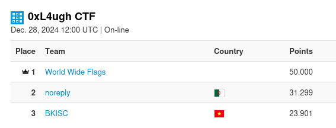

## 0xL4ugh CTF

0xL4ugh was a great CTF, featuring hardware challenges (which I always love to do). The hardware challenges were not too difficult, however they were stable and (as far as I understand) didn't involve actual hardware, which made it a lot more user-friendly than CTFs that use actual hardware.

I played together with the one and only World Wide Flags team and we came in first with a big lead of nearly 2k points! Good job everyone!!

