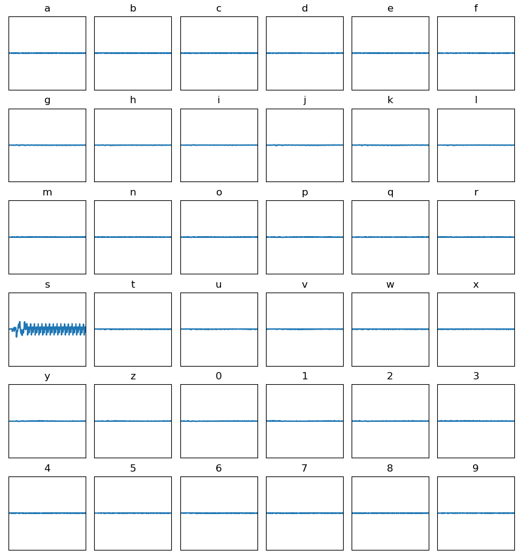

## Power-SCAndal

Power-SCAndal, as the name already hints, is another side channel analysis challenge. It is another timing side-channel, and it was trivially solved using SPA.
A key had to be provided to retrieve the flag. The key was lower-case alphanum. The following code was used to retrieve the key byte by byte:

```py
from pwn import *
import string
import numpy as np

HOST = "7c9164a04f2680c91f7950260021dc5b.chal.ctf.ae"

results = {}
prev = ""

for i in "abcdefghijklmnopqrstuvwxyz0123456789":
    r = remote(HOST, 443, ssl=True, sni=HOST)
    r.readuntil("> ")
    tosend = prev
    r.sendline(tosend.encode("ascii"))

    result = r.readall()

    result = r.readall().decode("ascii").replace("\n", "").replace("[", "").replace("]", "")
    result = np.fromstring(result, dtype=float, sep=' ')

    results[i] = result

with open(f'test.npy', 'wb') as f:
    np.save(f, results)
```

I started by retrieving the first byte and the traces that corresponded to them. Another little script was used to analyze the data, which can be seen at the bottom. This script grew as I solved the challenge. The first thing I did was to look at an animation showing the plots of the traces in succession. This revealed that there was one character that had a distinct trace compared to the others. I then went on to compute the differences between the traces and the mean-trace. This was even more revealing - most traces were pretty much identical but one. So all I needed to do was to extract the mean-difference-trace with the highest variance. Below, all the mean-difference-traces can be seen, where the one for the first character `s` clearly stands out. Iteratively doing this, revealed the key that could be used to get the actual flag.



*Grid of mean-difference-trace for each first character. The correct guess was `s`.*


```py
import numpy as np
import matplotlib.pyplot as plt
from matplotlib.animation import FuncAnimation

# Initialization function for the animation
def init():
    line.set_data([], [])
    return line, title

# Update function for the animation
def update(trace):
    line.set_data(range(trace.shape[0]), trace)

    return line, title

k = 800
l = 50

# Set up the figure and axis
fig, ax = plt.subplots()
line, = ax.plot([], [], lw=2)
title = ax.set_title("")
ax.set_xlim(0, k + 2*l)  # Set according to your data range
ax.set_ylim(-0.3, 0.3)  # Adjust based on your data's expected range


#sha3bola

d = np.load("test.npy", allow_pickle=True).item()

allvals = []
diffvals = []
keys = []

# print(d)

for k,v in d.items():
    allvals.append(v)
    keys.append(k)

for v in allvals:
    diffvals.append(v - np.array(allvals).mean(axis=0))

variances = []
for i in diffvals:
   variances.append(np.var(i))

print(f"Highest variance is: {keys[np.argmax(variances)]}")

# Create the animation
ani = FuncAnimation(
    fig, update, frames=allvals, init_func=init, blit=True, interval=100, repeat=False
)

# Show the animation
plt.show()
```