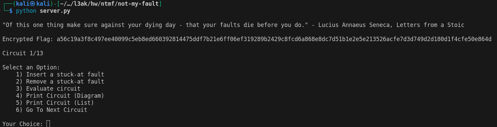
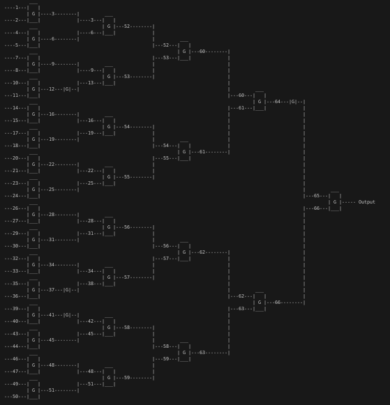
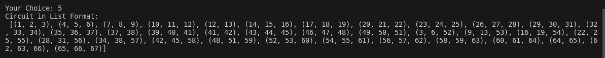
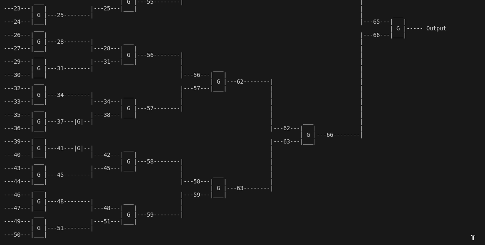
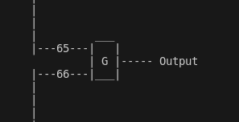
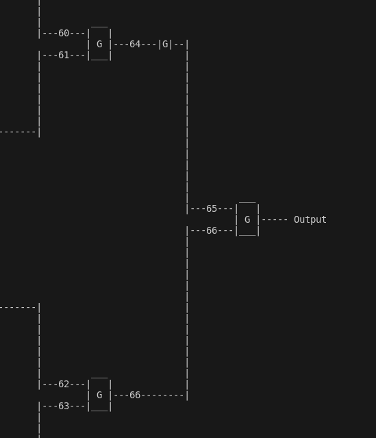

# Not My Fault!

(1 Solve (me :D))

## Intro

Not My Fault! was a fun challenge that revolved around stuck-at faults.

Usually, when we hear about faults in the context of hardware security, we think about fault-injection techniques, such as voltage fault injection or even laser fault injection, where the unprotected chip is blasted with a laser to induce faults. These faults then generate hiccups in the program control-flow in the IC and even allow for reconstructing encryption key material, see for example [FPGAhammer](https://tches.iacr.org/index.php/TCHES/article/view/7268/6446).

In VLSI design, stuck-at faults are faults that make it so that a certain net is pulled constantly to a high or low state, independently of its input. These faults can occur during manufacturing or from age. ICs can be tested against potential stuck-at-faults by providing a test-pattern to the inputs of the IC and measuring the output. As the number of possible test-patterns increases expoentially with the number of available inputs, doing an exhaustive test is often not possible. For this, automatic test-pattern generators have been divised that, given the hardware layout, find a minimum amount of test-patterns in order to test for all or at least the most crucical stuck-at faults.

For this challenge, we are going a different route - we inject stuck-at faults.

## The Challenge

When running the challenge, we are greeted with some kind of menu:



We can see that we are given an encrypted flag and the number of circuits we have to solve.
In addition to that, we have to make one of six choices:
-   Insert stuck-at fault
-   Remove stuck-at fault
-   Evaluate circuit
-   Print circuit as a diagram
-   Print circuit as a list
-   Go to the next circuit.

As a hardware hacker, the obvious first choice is: SHOW US THE CIRCUIT ALREADY! As a reponse, we get the following diagram:



We have a circuit that is composed of a cascade of gates, which are mostly two-input gates, with some smaller blocks that later turn out to be single-input gates in between (See for example net 12).
However, it looks like we are not told what the gates are. After digging through the source code for a while, it turns out that the gates are randomly chosen from `AND`, `NAND`, `OR`, `NOR`, `XOR` and `XNOR` gates.
So every gate can be any one of these gates, generating a 32-input logic function with a single output. The single-input gates in between can be either inverters (INV aka. NOT-gate) or buffers (BUF). For those rusty on the truth tables,
have a look at [this](https://tse1.mm.bing.net/th?q=logic%20gates%20cheat%20sheet) cheat-sheet. The buffers are not shown and if you are unsure what they are - think of them as a wire.

My natural instinct kicks in and I have to check if the circuit is the same on every run. It turns out that it is always a 32-input-1-output logic function, however the single-input gates are randomly sprinkled in between. Because of this, we can not simply assume the circuit topology to be constant.

When we pick the choice to see the circuit in list form, we get a python list of tuples, showing the input and output nets each gate connects to. This is the display form that our exploit will use to read the circuit topology. 


We can choose to evaluate the circuit, which gives us the output value of the current state. Running this repeatedly gives the same result, showing that the inputs are constant.

When we choose to insert a stuck-at fault, we are asked what net we want the stuck-at fault to be placed on. After that, we can choose whether to set the value of that net to `0` or `1`. A second option allows us to remove the stuck-at fault
on that net.

Finally, there's the option to go to the next circuit.

## The Goal

It was not clear at first what the goal of the challenge actually was. However, after digging through the code for a bit, we can see that a secret key is generated. This secret key is used to encrypt the flag. After that, the secret key is divided into chunks of 4 bytes (32 bit), and these 4-byte chunks are used as inputs to the circuit. So our goal is to retrieve the circuit's inputs to reconstruct the secret key and decrypt the flag, and we have to do that using stuck-at faults. Reading through the code we find 2 more restrictions: We are only allowed to evaluate each circuit 160 times, and we can only ever have 6 stuck-at faults active at the same time. Very interesting indeed.

## Challenge accepted

At first, it looked like the challenge might be needed to be done by hand. However, after I saw that there were 14 circuits to solve, I quickly changed my mind on that one! So we need to find an algorithm to solve this.

Looking at the circuit topology, the 6 available stuck-at faults are not only a restriction but also hint towards a solution: The critical path - the longest path through the circuit (including the input-net) - comprises 5 nets minimum. This number can increase due to the single-input gates sprinkled in between. 



The first step must be to fully uncover the circuit itself. We can not possibly know how an input affects the output without knowing the logic function the circuit provides - at least to a certain extent. As we want to know all the inputs, we need to know the whole logic function - there is no way around it. Looking at the problem as a whole is a bit overwhelming, so let's take a step back and make the problem easier:

## Divide and Conquer



The questions we should ask ourselves are:
- How can we know what function this gate represents?
- How can we identify the inputs to this function, once we know it?

The first one is easy: Each gate implements a truth table, which, for a 2-input gate has 4 possible states. If we can fix the inputs however we want using our stuck-at faults, we can simply try out all the possible combinations of `0` and `1` and thus build the truth table for this gate. There are ways to reduce the number of tries if only a reduced set of gates is used, but for this challenge, simply trying all of them was good enough. In the accompanying code, this is done in the `identify_gate` function. Single-input gates are even easier to catch: Just provide a `1` at the input and if there is a `1` on the output, it's a buffer, otherwise it's an inverter.

For the second question, we have to look at what gate we are facing. For each gate-type, we can find, what I call a __testpoint input__ (tp-input). Given a 2-input gate with inputs `a` and `b`, and given that we want to know what the input `a` is, a tp-input is an input we can provide to input `b`, such that either the value `a` OR its inverted value `~a` is passed through to the output. This tp-input is different for each gate-type. I added a `tp()` function to the gates provided in circuit.py and reused these gates in my code. Let us exemplarily look at the `tp`-function for the `NOR`-gate. First let us look at the truth table:

### NOR Truth Table

| x1| x2| y |
|---|---|---|
| 0 | 0 | 1 |
| 0 | 1 | 0 |
| 1 | 0 | 0 |
| 1 | 1 | 0 |

We can see on the truth table, that if we want know the input `x1`, we can set the input `x2` to be `0`. We then see the value of `~x1` at the output `y`, so we simply have to invert `y` and know `x1`. This obviously goes for both inputs, as the basic logic functions are all symmetrical. Thus, the `tp`-function for the `NOR`-gate looks like:

```python
class NOR:

    @staticmethod
    def tp():
        return (0, True)
```

This means: If you want to know one of the inputs, set the other input to `0` and invert (`True`) the output.

## Expanding

Now that we know how to tackle a single gate, what about more gates? Let's step one layer up:



Let's say, we know what kind of gate the output-gate is, can we identify the other gates? For simplicity, let's call each gate by it's output-net-number, so gate `66` is at the bottom, the output-gate is on the right and the top-path contains gates `64` and the single-input gate `65`. 

Let's focus on gate `66` first. The gate itself can be given all the input combinations to cycle through its truth table. But how do we see the output of that gate at the output of the whole circuit? Here is where our test-point inputs come in handy again. We simply set net `65` to be the test-point input for the output-gate. With this, the output of gate `66` can be read from the output of the whole circuit, such that we can identify the gate-type. We can go through and do this for each of the gates `66`, `65` and then `64`. From here, we can then expand further down the circuit again, which hints heavily towards the recursive implementation that I finally used: 

```
To identify a gate:
    Find its children
    If it is a 2-input gate:
        Fix input A using an SA fault
        Identify the child that hangs on input B
        Remove the SA fault on input A
        Fix input B using an SA fault
        Identify the child that hangs on input A
        Remove the SA fault on input B
```

## The constraints

It seems that, in the naive implementation, we need 4 evaluations per gate to find out its truth table. To find the truth table for a single-input gate, we need 1 evaluation. Finally, once we know the whole 32-input logic function, we need 32 evaluations to find the constant inputs to the function and retrieve the secret 4-byte chunk. With 16 + 8 + 4 + 2 + 1 2-input gates, this sums to 124 + 32 = 156 evaluations, which comes dangerously close to the 160 evaluations we are allowed. So if there are more than 4 single-input gates in the circuit, we will get stuck!

In order to circumvent this, we can do a little trick. When we look at the available 2-input gates, we can see `AND`, `NAND`, `OR`, `NOR`, `XOR` and `XNOR` gates. It is obvious that for each gate, there is also an inverted gate. This means, that we can simply prune the single-input gates out of the circuit. For example, if there was an `INV` following an `AND`, it now becomes a `NAND`. If there was a `BUF` following a `NOR`, it will simply stay a `NOR`. This allows us to always stay at exactly 156 evaluations per circuit, which is below the necessary limit. The function `prune_single_input_gates(circuit)` takes care of this in the accompanying implementation.

And that's basically it! After implementing all of that in `circuitbreaker.py` and running it locally, I received my flag! I turned to the remote and... it was very slow. It took 45 minutes to complete a single run and I was greeted by a flag that looked like this: `L3AK{F4uLt_1nJ3cti0N_C4n_M4k3_4NY_C1RCuIT_iN53cu`. I had the secret chunks, so I could easily reconstruct the secret key, however I had a lot of debug output. This made it so the encrypted flag scrolled out of my terminal and I had to actually run it again. I didn't want to wait another 45 minutes, so I looked up where the server was located, rented a linode server in the same area and voila, for only 6 cent I brought down the runtime from 45 minutes to 8 minutes! Very well invested money in my books.

It turned out, that instead of decrypting the flag using `plaintext = cipher.decrypt(bytes.fromhex(encflag))`, it was necessary to also `unpad` it, as so: `plaintext = unpad(cipher.decrypt(bytes.fromhex(encflag)), AES.block_size)`.

Being greeted with the flag made up for the hard work. A very fun challenge indeed!