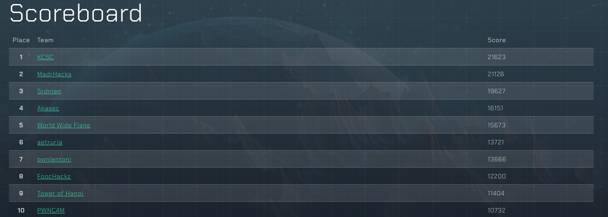

# L3AK CTF

This was a medium to medium-hard CTF with most of the challenges being quite challenger and not approachable for beginners. It was quite fun, especially since there was a lot of reversing to be done. The best part was the Hardware-RF part, where 7 challenges could be found which I naturally focused most of my time on.

I played together with the World Wide Flags team and we came out on 5th place and won 100$! 
(5 / 497 teams with at least 1 flag ~> Top 1%)

