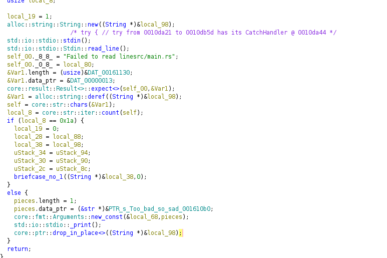
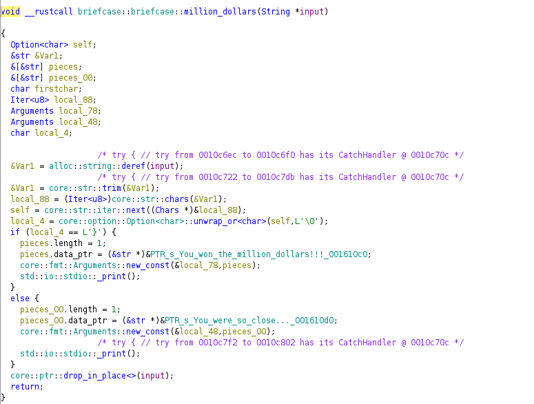
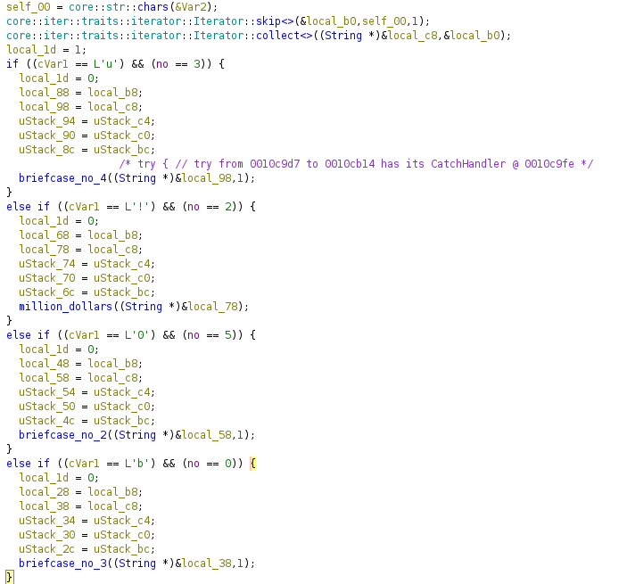
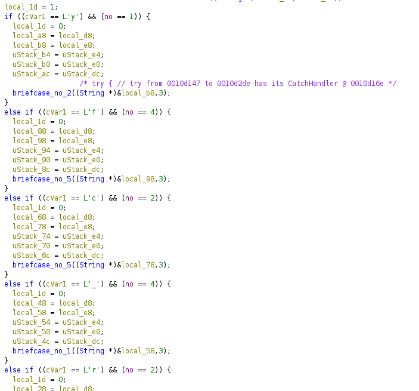

## Deal Or No Deal

(39 solves)

This was a relatively straight-forward rust rev-challenge. It contained one small gotcha.

We disassemble the code in Ghidra and after running analysis and following the main-function, we find
the function briefcase::briefcase::main, which seems to be our entry point. 

There is big if-else-block and it looks as if we don't want to take the else-branch.
So the goal is to have `local_8` be `0x1a` here. `local_8` seems to be the `count` of `self`, which
if we follow it upwards, is the string we get out of `read_line()`. So it's the number of characters we
need to give the program, that's easy!



So when we provide a string with `0x1a` characters, we actually open the first briefcase, yay us!
But it's not the flag, hmm? Okay, another level. And there is a function called `million_dollars()` that looks juicy. However, it doesn't seem to print the flag or anything, it just tells us that we have won a million dollar (Spoiler: we don't actually get the million dollars).



Apparently the `no` variable has a lot of influence on what we are allowed to do. We get the idea that we might need to provide the flag ourselves and go from level to level, which also turns to be correct.



Now the first idea is to simply brute-force it, so I wrote a script for that. However, that turned out to not work as expected, because the `switch-case` only accepts certain values. So I condensed the script down to manually give it the choices for each level while following the path in Ghidra. So for example for level two, which can be seen on above screenshot, we would enter `u!0b` as potential values in the script and it would pick the correct one based on the programs output. That script can be seen here:

```python
import subprocess
import string
import logging

logging.basicConfig(level=logging.DEBUG)
logger = logging.getLogger()

ipt = [" "] + [" "]*24 + ["\n"]

def ipt_to_str(ipt):
    return "".join(ipt)

def get_opt(ipt):
    ipt = ipt_to_str(ipt)
    print(ipt)

    x = subprocess.check_output(f'''echo "{ipt}" | ./briefcase_ex''', shell=True).decode("ascii")
    return x, len(x.split("\n"))

current_length, opt = get_opt(ipt)

for i in range(26):
    pot = input("Next potentials:")
    found = False
    for c in pot:
        ipt[i] = c

        length, opt = get_opt(ipt)
        logger.debug(f"{i}: {c} -- {length} ({opt})")

        if length > current_length:
            current_length = length
            logger.warning(f"Found! {c}. Now {ipt_to_str(ipt)}")
            found = True
            break
    if not found:
        i -= 1

logger.info(f"Result: {ipt_to_str(ipt)}")
```

So we ran this and get a flag! `byuctf{y0u_rust!}`. But when we try to plug that flag in, it doesn't accept it. HEY!
But we don't give up now. So we look more closely at what the code says and get to `byuctf{y0u_`, with `no = 2`. From here,
we can either go to `byuctf{y0u_c` or `byuctf{y0u_r` as seen below.



Knowing this, we are a bit more careful at following the code and only plug in what we expect to be correct (Okay, at this point the script is useless and we could have just written it down in a text-editor, but I didn't have time to code a full-fledged text-editor!)

So we follow the code, get the `million_dollar()` and with it, the flag to win the challenge.