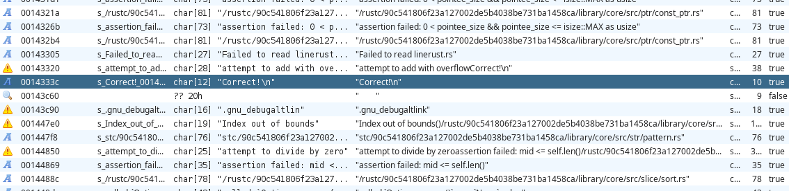
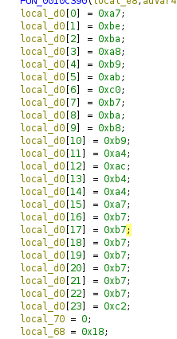
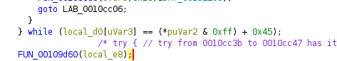

## RUST

The title fits the challenge. It simply consists of some rust reversing.

Before looking at anything, we first look at the strings in the code. We install [RustCrateStringExtractor
](https://github.com/BinaryDefense/GhidraRustDependenciesExtractor) for this and then look at the strings. 
The one that jumps out at us is `Correct!`:



So we check the references to find where this string is used and find the function.
After some static analysis, we find that there is an array in the stack, which is compared to some other array in a `do...while`-loop. The values from the second array are augmented by `0x45` before being compared:




A first naive idea is: What happens to the array data when we subtract `0x45` from it? `0xa7 - 0x45 = 0x62` which is a lowercase `b`. Now that sounds very interesting! Let's test the next one. `0xbe - 0x45 = 0x79` which is `y`! So this is the flag. I did this in the python console during the CTF so I don't have the original script, however a simple solution could look like:

```python
[print(chr(x-0x45), end="") for x in[0xa7, 0xbe, ...]]
```


