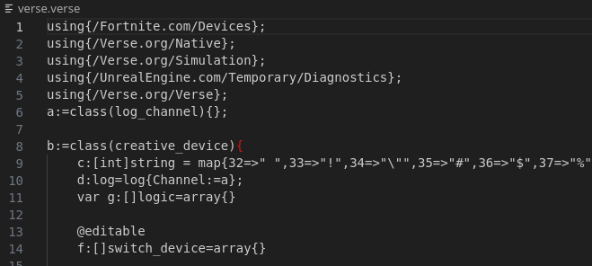
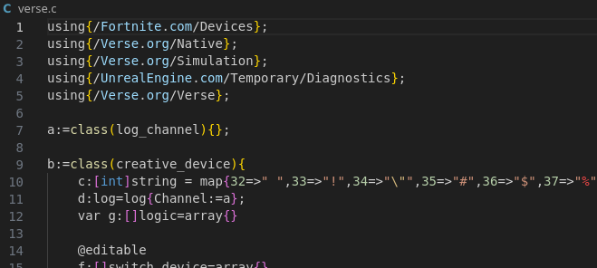

## Verse

(45 solves)

This was an interesting challenge because for most of us `verse` is an unknown language.

We get some cursed code that references the `UnrealEngine` and `Colonel`, one my teammates, knew that this is
some script for UnrealEngine. So we expect some engine scripting with all that includes.



We love our syntax-highlighting, and as it looks similar to C code, we call the file verse.c and let VSCode do it's linting magic.



Better. Now for the scripting part. I didn't have time to RTFM, because I'm sure reversing a scripting language for 30 minutes will save me from reading 2 minutes of documentatino. There's stuff called `class`es and the functions seem to be defined as `funcname():return_type={ code }`. Fair enough.
There are `decorators` like `@editable`. Having some UnityEngine background, this strongly suggested that these are UI controls that are exposed in the editor and can be edited. I looked up what switch_device was (Okay, I broke my rule here), and found out it must be some kind of check-box. So `f` is an array of check-boxes? This will become interesting later.

Right at the end of the code, we find a snippet that reads:

```c
OnBegin<override>()<suspends>:void={h.InteractedWithEvent.Subscribe(ae);
```

This looks terribly like subscribing a function to a button event. So probably `ae` is our `main`-function.

```c
// ae

ae(af:agent):void={
    l();
    aa();
    for(ag:=0..k.Length-1){
        if(ah:logic=k[ag]){
            if(ah<>j[j.Length-ag-1]){
                d.Print("No");
                return;
            }
        }
    };
}
```

Okay so this calls two functions, then runs a for loop over some array `k`. At the locations that `k` returns is `true`, it compares the contents of `k` to the contents of the inverted version of `j`. Again I broke my rule and looked up the `<>` operator. It means `not equal`.

`k` seems to be an array containing truth values:

```c
k:[]logic=array{true,false,true,...}
```

So in python terms, `k` must be equal to `j[::-1]`. What is j though? Maybe the other functions give more intel on this. What does `aa` do?

```c
aa():void={
    var m:[]logic=array{};
    for(ab:=1..g.Length){
        set m+=array{false};
    };

    set j=m;
    for(ac:=0..i.Length-1){
        if(ad:tuple(int,int)=i[ac]){
            x:int=ad(0);
            y:int=ad(1);

            if(set j[x]=g[y]){};
            if(set j[y]=g[x]){};
        }
    }
};
```

First we create an empty array `m` that we fill with `len(g)` values of `false`.
We then set `j = m` (This is the `j` we compare `k` to in the previous function, nice!)

Then we iterate over `i` and modify the values in `j` based on the values in `i`. What is `i` though?

```c
i:[]tuple(int,int)=array{(180,252),(174,213),(110,395),(38,364),...}
```

`i` is an array of tuples containing __coordinates__. So in `aa`, what we do is to swap the values in `g` based on
the coordinates in `i` and assign them to `j` to populate it. We still don't know what `g` is though, but we have another function available for analysis: `l()`

```c
l():void={
    var m:[]logic=array{};
    for(n:=1..f.Length){
        set m+=array{false};
    };

    set g=m;

    for(o:=0..f.Length-1){
        if(p:=f[o]){
            var q:logic=false;
            if(p.GetCurrentState[]){
                set q=true;
            };
            if(set g[o]=q){

            }
        }
    }
};
```

`l` again first allocates an array of `len(f)` values of `false`. After that, we iterate over `f`, which we said at the start to be an array of check-box values. So basically, we control this array `g`.

Now, after all this has been done, we print `r(g)`:

```c
d.Print(r(g));
```

So the questions that are still open: What is `r()` and how does everything fit together? Let's see `r()` first.

```c
r(s:[]logic):string={
    if(Mod[s.Length,8]<>0){
        return "";
    };

    var t:string="";
    var u:int=0;

    if(set u=Floor(s.Length/8)){};

    for(v:=0..u-1){
        var w:int=0;

        for(x:=0..8){
            if(s[(v*8)+x]=true){
                if(y:=Floor[Pow(2.0,(7-x)*1.0)]){
                    set w+=y;
                }
            }
        };

        if(z:=c[w]){
        set t+=z;
        }
        else{
            set t+="?";
        }
    };
    return t;
};
```

Honestly, I didn't even bother reading this function, I just plugged it into ChatGPT and let it translate it to python code, which gave me:

```python
def reconstruct_string(logic):
    # Check if the length of the input is a multiple of 8
    if len(logic) % 8 != 0:
        return ""

    result = ""
    # Calculate how many full bytes are in the input
    num_bytes = len(logic) // 8

    # Process each byte
    for byte_index in range(num_bytes):
        byte_value = 0

        # Convert each bit in the byte to the corresponding integer value
        for bit_index in range(8):
            if logic[byte_index * 8 + bit_index]:
                # Calculate the value of the bit using powers of 2
                byte_value += 2 ** (7 - bit_index)

        # Map the byte value to its ASCII character, use '?' for non-mappable values
        try:
            result += themap[byte_value]
        except:
            result += "?"

    return result

```

And following it's instructions, we can see that the truth-values we give it in the `logic`-array are treated as bits. The thusly generated bytes will then be interpreted according to the following mapping:

```py
themap = {32:" ",33:"!",34:"\"",35:"#",36:"$",37:"%",38:"&",39:"'",40:"(",41:")",42:"*",43:"+",44:",",45:"-",46:".",47:"/",48:"0",49:"1",50:"2",51:"3",52:"4",53:"5",54:"6",55:"7",56:"8",57:"9",58:":",59:";",60:"<",61:"=",62:">",63:"?",64:"@",65:"A",66:"B",67:"C",68:"D",69:"E",70:"F",71:"G",72:"H",73:"I",74:"J",75:"K",76:"L",77:"M",78:"N",79:"O",80:"P",81:"Q",82:"R",83:"S",84:"T",85:"U",86:"V",87:"W",88:"X",89:"Y",90:"Z",91:"[",92:"\\",93:"]",94:"^",95:"_",96:"`",97:"a",98:"b",99:"c",100:"d",101:"e",102:"f",103:"g",104:"h",105:"i",106:"j",107:"k",108:"l",109:"m",110:"n",111:"o",112:"p",113:"q",114:"r",115:"s",116:"t",117:"u",118:"v",119:"w",120:"x",121:"y",122:"z",123:"{",124:"|", 125:"}"}
```

With all that knowledge, let's go back to the `ae` function and try to reconstruct in natural language what it does:

```c
// ae

ae(af:agent):void={
    l();
    aa();
    for(ag:=0..k.Length-1){
        if(ah:logic=k[ag]){
            if(ah<>j[j.Length-ag-1]){
                d.Print("No");
                return;
            }
        }
    };
}

d.Print(r(g));
```

* `l()`        -> Get the truth values from the check-boxes and fill `g` with them. This simply gets our `input`-array.
* `aa()`       -> Swap the truth values in the `input`-array according to the coordinates in `k` and store that in `j`
* rest of ae   -> Check if `j[::-1] == k`
* finally      -> Reconstruct characters from `g` and print them.

When we look closely at function `aa`, we can see that it might actually be bijective if we are lucky and the coordinates play in our favor. If this is the case, we should be able to push `k[::-1]` through it and retrieve `g` from it, which we can then run through `r()` and reconstruct the flag. And this is exactly what worked and finally gave us the flag. The complete python code to do this was:

```python
themap = {32:" ",33:"!",34:"\"",35:"#",36:"$",37:"%",38:"&",39:"'",40:"(",41:")",42:"*",43:"+",44:",",45:"-",46:".",47:"/",48:"0",49:"1",50:"2",51:"3",52:"4",53:"5",54:"6",55:"7",56:"8",57:"9",58:":",59:";",60:"<",61:"=",62:">",63:"?",64:"@",65:"A",66:"B",67:"C",68:"D",69:"E",70:"F",71:"G",72:"H",73:"I",74:"J",75:"K",76:"L",77:"M",78:"N",79:"O",80:"P",81:"Q",82:"R",83:"S",84:"T",85:"U",86:"V",87:"W",88:"X",89:"Y",90:"Z",91:"[",92:"\\",93:"]",94:"^",95:"_",96:"`",97:"a",98:"b",99:"c",100:"d",101:"e",102:"f",103:"g",104:"h",105:"i",106:"j",107:"k",108:"l",109:"m",110:"n",111:"o",112:"p",113:"q",114:"r",115:"s",116:"t",117:"u",118:"v",119:"w",120:"x",121:"y",122:"z",123:"{",124:"|", 125:"}"}

coords = [(180,252),(174,213),(110,395),(38,364),(255,171),(399,301),(93,194),(262,105),(169,18),(283,433),(346,181),(247,151),(408,67),(360,333),(57,418),(290,322),(463,219),(389,467),(317,420),(65,116),(162,31),(327,449),(158,130),(279,226),(79,404),(321,442),(19,357),(60,127),(41,296),(293,319),(244,133),(195,387),(220,62),(250,77),(473,288),(234,134),(325,385),(138,266),(254,76),(330,201),(435,417),(400,86),(431,30),(141,304),(456,114),(89,106),(12,432),(265,248),(388,446),(328,356),(308,27),(95,119),(63,359),(90,44),(245,362),(88,368),(58,394),(185,375),(48,354),(49,179),(347,374),(348,157),(205,183),(415,100),(103,107),(97,33),(474,284),(261,369),(273,477),(314,320),(297,164),(451,3),(460,332),(224,47),(462,351),(142,115),(140,315),(312,246),(54,264),(136,338),(468,39),(324,339),(380,84),(197,379),(102,427),(472,200),(104,147),(251,278),(295,228),(452,358),(202,422),(406,361),(281,232),(148,267),(334,371),(193,0),(457,131),(208,225),(407,215),(298,176),(132,443),(440,258),(35,111),(101,37),(256,426),(203,274),(25,206),(61,231),(291,421),(192,428),(137,355),(454,241),(15,455),(294,350),(373,352),(285,187),(412,282),(124,99),(275,311),(123,28),(121,168),(91,188),(218,397),(243,398),(270,117),(475,211),(113,42),(163,17),(68,146),(199,112),(160,51),(391,377),(217,337),(126,403),(268,409),(207,74),(343,139),(24,378),(383,340),(186,466),(87,92),(313,410),(230,402),(96,453),(21,94),(85,154),(269,307),(419,260),(56,271),(50,214),(405,287),(365,376),(366,263),(55,204),(53,120),(461,471),(237,249),(1,233),(161,216),(302,437),(242,450),(69,7),(335,80),(277,396),(16,66),(2,318),(83,331),(45,36),(223,310),(309,78),(6,272),(52,173),(191,286),(23,178),(370,342),(189,4),(436,445),(227,329),(414,82),(152,384),(165,240),(150,81),(46,253),(401,413),(170,276),(259,363),(382,316),(323,175),(73,159),(108,109),(306,236),(238,13),(459,196),(75,305),(448,239),(257,425),(229,476),(172,210),(479,149),(11,29),(129,381),(5,326),(182,43),(128,167),(280,434),(14,424),(292,118),(145,212),(393,198),(9,300),(177,155),(447,441),(26,70),(190,289),(40,156),(390,144),(98,465),(458,372),(303,32),(64,135),(166,72),(438,478),(299,336),(153,464),(10,386),(444,341),(34,423),(221,439),(349,367),(59,469),(470,392),(209,184),(222,122),(416,344),(8,235),(345,71),(430,353),(20,125),(22,411),(429,143)]

k = [True,False,True,True,True,True,False,False,True,False,True,False,True,False,True,True,True,False,True,False,False,False,True,True,True,True,False,True,False,True,True,True,True,False,True,False,False,True,True,False,False,False,False,False,True,False,True,True,True,True,True,False,False,False,True,False,True,True,False,False,True,True,False,False,True,True,True,False,False,True,False,False,False,True,True,True,True,True,True,True,True,False,True,True,False,True,True,True,False,False,True,False,True,True,True,False,True,False,True,False,False,False,False,True,True,False,False,True,True,False,True,False,True,True,False,False,True,True,False,True,False,True,True,False,True,False,False,False,True,True,True,True,True,False,False,False,False,True,True,True,False,False,True,False,False,True,False,True,True,True,False,True,False,False,True,False,True,True,True,True,False,True,True,False,False,False,True,False,False,False,False,False,True,False,False,False,False,True,False,True,False,False,True,True,True,True,False,True,True,True,True,True,False,True,True,True,True,False,False,True,True,False,False,True,True,True,True,True,False,True,True,True,False,True,False,True,False,True,True,False,False,False,True,True,False,True,True,False,True,False,False,True,True,False,True,True,True,True,True,True,False,False,True,False,False,False,True,True,True,True,True,False,True,True,False,False,True,True,False,False,True,False,True,True,True,True,False,True,True,True,False,True,True,True,True,True,True,True,True,False,False,True,False,True,False,True,False,False,True,True,False,True,True,True,False,True,True,False,True,False,True,True,False,True,False,False,True,True,False,True,True,True,False,False,False,True,True,True,False,True,True,True,True,False,True,False,False,False,True,True,True,True,False,True,False,True,True,False,False,False,True,True,False,True,False,True,False,True,False,False,True,True,False,False,False,False,False,False,False,False,True,False,False,True,False,False,True,True,True,True,False,False,False,True,True,False,False,False,True,True,False,False,True,True,False,True,True,True,True,False,True,False,True,False,True,True,False,False,True,True,True,True,True,False,True,True,True,True,True,True,False,True,False,False,True,True,False,False,True,True,True,True,True,False,False,False,False,False,False,False,True,True,False,True,False,False,True,True,False,False,True,False,True,True,True,False,True,True,False,False,True,False,True,False,False,True,True,False,True,True,True,True,True,True,True,False,True,False,False,True,False,True,False,False,False,True,True,True,True,True]

def reconstruct_string(logic):
    # Check if the length of the input is a multiple of 8
    if len(logic) % 8 != 0:
        return ""

    result = ""
    # Calculate how many full bytes are in the input
    num_bytes = len(logic) // 8

    # Process each byte
    for byte_index in range(num_bytes):
        byte_value = 0

        # Convert each bit in the byte to the corresponding integer value
        for bit_index in range(8):
            if logic[byte_index * 8 + bit_index]:
                # Calculate the value of the bit using powers of 2
                byte_value += 2 ** (7 - bit_index)

        # Map the byte value to its ASCII character, use '?' for non-mappable values
        try:
            result += themap[byte_value]
        except:
            result += "?"

    return result

def swap_g_into_j_according_to_coords(inp):
    # Initialize a list of False values of the same length as g
    m = [False] * len(inp)

    # Assign this list to j
    outp = m.copy()

    # Iterate over each tuple in the coordinates list (assuming i contains tuples (int, int))
    for (x, y) in coords:
        # Swap values based on the indices provided by the tuples
        outp[x] = inp[y]
        outp[y] = inp[x]

    return outp

g = swap_g_into_j_according_to_coords(k[::-1])

print(reconstruct_string(g))
```
