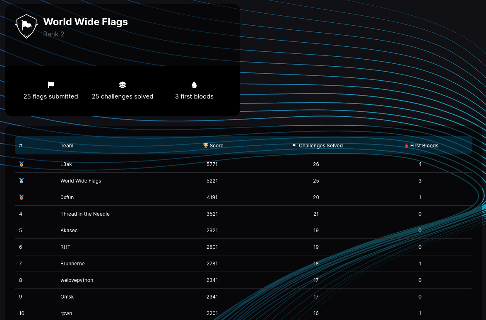

# DEADSEC CTF

This was a well-rounded CTF, with some difficult challenges in the `rev` category. 
I could only solve a single challenge and busied myself with a difficult reversing challenge for the rest of the CTF.

I played together with the World Wide Flags team who killed it in basically all other cats! Good job everyone! We came out in second place, only lead by L3AK.
(2 / 619 teams with at least 1 flag ~> > Top 1%)

